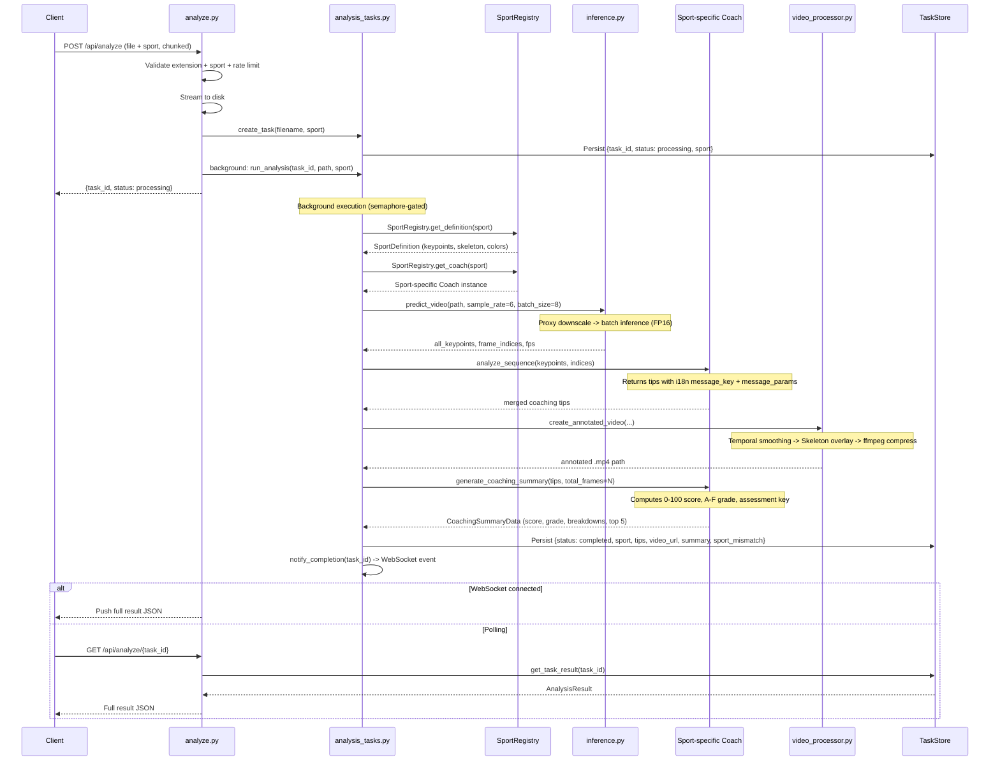
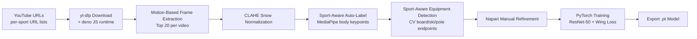

# Architecture Document

## 1. System Overview

```mermaid
graph TB
    subgraph Client
        SPA[React SPA<br/>Vite + TypeScript + Tailwind<br/>react-i18next · 10 languages<br/>Mobile-responsive]
    end

    subgraph Server
        API[FastAPI + GZip + Rate Limiting]
        WS[WebSocket Handler]
        AUTH[Auth Router<br/>Google / Facebook / Email<br/>PBKDF2-SHA256 + JWT]
        SPORTS[Sports Router<br/>SportRegistry listing + Wishlist]
        PAY[Payments Router<br/>Stripe Checkout + Webhooks]
        ADMIN[Admin Router<br/>Stats · Users · Discount Codes]
        VIDEOS[Videos Router<br/>Save · List · Delete · Quota]
        BG[BackgroundTask<br/>Semaphore-controlled]
        INF[Inference Service<br/>PyTorch / DLC / Mock<br/>Batch + FP16]
        COACH[Coaching Engine<br/>Per-sport Coach classes<br/>Biomechanical Analysis<br/>i18n message keys]
        VP[Video Processor<br/>Skeleton Annotation + Smoothing + FFmpeg]
        SD[Scene Detection<br/>CLIP-based sport mismatch]
        CLEANUP[Periodic Cleanup<br/>Hourly]
    end

    subgraph Storage
        DB[(SQLite / PostgreSQL<br/>Users · Subscriptions<br/>Analyses · DiscountCodes)]
        UPL[uploads/]
        RES[results/]
        STORE[(File-backed<br/>TaskStore<br/>task_store/*.json)]
        WISH[wishlist/<br/>wishlist.jsonl]
        MODEL[models/<br/>{sport_id}_pose_model.pt]
    end

    subgraph ML Pipeline
        DC[Data Collection<br/>yt-dlp + frame extraction]
        LAB[Labeling<br/>MediaPipe + CV + Napari]
        TRAIN[Training<br/>ResNet-50 + PyTorch]
        EXP[Export<br/>.pt checkpoint]
    end

    SPA -- "POST /api/analyze (file + sport)" --> API
    SPA -- "WS /api/ws/{id}" --> WS
    SPA -- "GET /api/analyze/{id}" --> API
    SPA -- "GET /api/sports/" --> SPORTS
    SPA -- "POST /api/auth/login, /register" --> AUTH
    SPA -- "POST /api/sports/wishlist" --> SPORTS
    SPA -- "POST /api/payments/create-checkout" --> PAY
    SPA -- "GET /api/admin/*" --> ADMIN
    SPA -- "GET /api/videos/my-videos" --> VIDEOS
    SPA -- "GET /results/*.mp4" --> RES
    API --> BG
    BG --> INF
    INF --> MODEL
    BG --> COACH
    BG --> SD
    BG --> VP
    VP --> RES
    BG --> STORE
    BG -- "notify_completion" --> WS
    API --> STORE
    API --> UPL
    AUTH --> DB
    PAY --> DB
    ADMIN --> DB
    VIDEOS --> DB
    SPORTS --> WISH
    CLEANUP --> UPL
    CLEANUP --> RES
    CLEANUP --> STORE

    DC --> LAB --> TRAIN --> EXP --> MODEL
```

## 2. Directory Structure

```
ai-sports-analysis/
├── backend/
│   ├── app/
│   │   ├── __init__.py
│   │   ├── config.py                 # pydantic-settings, tier limits, Stripe config
│   │   ├── main.py                   # FastAPI app, CORS, GZip, rate limiting, security headers, cleanup
│   │   ├── database.py               # SQLAlchemy engine, SessionLocal, Base, get_db, init_db
│   │   ├── db_models.py              # ORM: User, AnalysisRecord, Subscription, DiscountCode
│   │   ├── dependencies.py           # JWT auth: create_access_token, get_current_user, require_role, check_video_quota
│   │   ├── models/
│   │   │   ├── __init__.py
│   │   │   └── schemas.py            # Pydantic: analysis, auth, register, payments, admin, videos
│   │   ├── routers/
│   │   │   ├── __init__.py
│   │   │   ├── analyze.py            # POST /api/analyze, GET /api/analyze/{id}, WS /api/ws/{id}
│   │   │   ├── auth.py               # POST /api/auth/login, /register, /guest-save, GET /api/auth/me
│   │   │   ├── sports.py             # GET /api/sports/, POST /api/sports/wishlist
│   │   │   ├── payments.py           # Stripe checkout, webhooks, subscription, cancel, discount validation
│   │   │   ├── admin.py              # Stats, user CRUD, role/tier, discount codes (admin-gated)
│   │   │   └── videos.py             # my-videos, save (quota enforced), delete
│   │   ├── sports/
│   │   │   ├── __init__.py            # Imports all sport modules to trigger registration
│   │   │   ├── base.py               # SportDefinition, SportCoach protocol, KeypointDef, SkeletonConnection
│   │   │   ├── registry.py           # SportRegistry singleton (register, get_definition, get_coach, list_sports, has_sport)
│   │   │   ├── snowboard.py          # Snowboard sport definition + registration
│   │   │   ├── skiing.py             # Skiing sport definition + registration
│   │   │   ├── running.py            # Running sport definition + registration
│   │   │   ├── home_workout.py       # Home workout sport definition + registration
│   │   │   ├── yoga.py               # Yoga sport definition + registration
│   │   │   └── golf.py               # Golf sport definition + registration
│   │   ├── services/
│   │   │   ├── __init__.py
│   │   │   ├── inference.py          # PyTorchPoseEstimator (batch+FP16), PoseEstimator (DLC), MockPoseEstimator
│   │   │   ├── scene_detection.py    # CLIP-based sport mismatch detection
│   │   │   ├── snow_coach_logic.py   # Compatibility shim: re-exports from coach_logic package
│   │   │   ├── video_processor.py    # Skeleton overlay, temporal smoothing, adaptive sizing, ffmpeg
│   │   │   └── coach_logic/
│   │   │       ├── __init__.py
│   │   │       ├── base.py           # CoachingTip, Severity, Confidence, compute_angle, merge_consecutive_tips, generate_coaching_summary, _compute_numeric_score
│   │   │       ├── snowboard.py      # SnowboardCoach
│   │   │       ├── skiing.py         # SkiingCoach
│   │   │       ├── running.py        # RunningCoach
│   │   │       ├── home_workout.py   # HomeWorkoutCoach
│   │   │       ├── yoga.py           # YogaCoach
│   │   │       └── golf.py           # GolfCoach
│   │   └── tasks/
│   │       ├── __init__.py
│   │       └── analysis_tasks.py     # TaskStore (file-backed), semaphore, WebSocket, model preload
│   ├── tests/
│   │   ├── __init__.py
│   │   ├── conftest.py               # Shared fixtures: test_db, db_session, admin_user, regular_user
│   │   ├── test_api.py               # 19 tests: upload, polling, sport validation, auth, wishlist
│   │   ├── test_auth.py              # 8 tests: register, login, OAuth, JWT, /me
│   │   ├── test_admin.py             # 9 tests: stats, user management, discount codes
│   │   ├── test_coaching_quality.py  # 29 tests: boundaries, messages, i18n, merging, summaries, regressions
│   │   ├── test_coach_logic.py       # 20 tests: per-sport coach analysis, multi-sport scoring
│   │   ├── test_performance.py       # 9 tests: latency, throughput, memory benchmarks
│   │   ├── test_config.py            # 12 tests: sport definitions, registry, settings
│   │   ├── test_e2e_sport_detection.py # 26 tests: positive, negative, unrelated sport detection
│   │   ├── test_e2e_analysis.py      # 55 tests: end-to-end analysis pipeline per sport
│   │   ├── test_inference.py         # 8 tests: mock estimator frame/video predictions
│   │   ├── test_snow_coach_logic.py  # 16 tests: angle math, frame analysis, sequence merging
│   │   ├── test_task_store.py        # 8 tests: CRUD, persistence, cleanup, sport field
│   │   ├── test_video_processor.py   # 12 tests: limb colors, skeleton drawing, keypoint smoothing
│   │   └── test_videos/              # Synthetic test videos and download helpers
│   ├── uploads/                      # Uploaded video files (gitignored)
│   ├── results/                      # Annotated output videos (gitignored)
│   ├── task_store/                   # Persistent task JSON files (gitignored)
│   ├── wishlist/                     # Sport wishlist entries (gitignored)
│   └── requirements.txt              # FastAPI, SQLAlchemy, PyTorch, OpenCV, Stripe, python-jose
├── frontend/
│   ├── src/
│   │   ├── main.tsx                  # React entry point + i18n import
│   │   ├── i18n.ts                   # i18next config: 10 languages, HTTP backend, browser detection
│   │   ├── App.tsx                   # Root FSM, routing (main/pricing/admin), auth persistence
│   │   ├── components/
│   │   │   ├── UploadZone.tsx        # Sport selector + drag-and-drop upload with progress bar
│   │   │   ├── SportSelector.tsx     # Sport picker with emoji buttons
│   │   │   ├── ProcessingState.tsx   # Wait time estimation, fun facts ticker, pipeline steps
│   │   │   ├── ResultsView.tsx       # Responsive 2-column layout: video + coaching cards + save
│   │   │   ├── VideoPlayer.tsx       # HTML5 video with imperative seekTo()
│   │   │   ├── HowToImprove.tsx      # Overall A-F score + groups tips by category
│   │   │   ├── ImprovementCard.tsx   # Expandable card with illustration + drills + i18n
│   │   │   ├── LoginModal.tsx        # Google/Facebook/email login+register, i18n
│   │   │   ├── WishlistModal.tsx     # "Coming Soon" notification signup, i18n
│   │   │   ├── LanguageSelector.tsx  # 10-language dropdown with flags
│   │   │   └── illustrations/        # SVG coaching diagrams (sport-specific)
│   │   ├── pages/
│   │   │   ├── Pricing.tsx           # Free vs Pro comparison, discount codes, Stripe checkout
│   │   │   └── Admin.tsx             # Tab-based: Dashboard, Users, Discount Codes
│   │   │       ├── admin/Dashboard.tsx
│   │   │       ├── admin/UserManagement.tsx
│   │   │       └── admin/DiscountCodes.tsx
│   │   ├── data/
│   │   │   ├── coachingGuidance.ts   # Coaching text, drills with difficulty/duration per sport
│   │   │   └── sportFacts.ts         # Fun facts per sport for processing wait screen
│   │   ├── services/
│   │   │   ├── api.ts               # Axios client + JWT interceptor, all API methods
│   │   │   └── adminApi.ts          # Admin-specific API client
│   │   ├── types/
│   │   │   └── analysis.ts          # TypeScript: analysis, auth, sports, videos, admin
│   │   ├── test/
│   │   │   ├── setup.ts             # Vitest setup + react-i18next mock
│   │   │   ├── components.test.tsx   # 8 tests: SportSelector, LoginModal, WishlistModal
│   │   │   ├── sportFacts.test.ts    # 4 tests: fact filtering by sport
│   │   │   ├── coachingGuidance.test.ts # 10 tests: guidance lookup, fallback, drills
│   │   │   ├── coachingQuality.test.ts  # 9 tests: sport/category coverage, content quality
│   │   │   └── performance.test.ts      # 4 tests: load time, locale validity, translations
│   │   └── index.css                 # Tailwind import, dark base, mobile optimizations
│   ├── public/
│   │   └── locales/                  # i18n translation files
│   │       ├── en/                   # English (default)
│   │       │   ├── common.json       # UI strings
│   │       │   └── coaching.json     # Coaching tips, guidance, sport facts
│   │       ├── fr/                   # French
│   │       ├── es/                   # Spanish
│   │       ├── it/                   # Italian
│   │       ├── ja/                   # Japanese
│   │       ├── de/                   # German
│   │       ├── de-AT/                # Austrian German
│   │       ├── ru/                   # Russian
│   │       ├── hi/                   # Hindi
│   │       └── cs/                   # Czech
│   ├── index.html                    # SPA entry point with meta tags, Open Graph, PWA manifest
│   ├── vite.config.ts                # Vite + React + Tailwind, WS proxy, Vitest, chunk splitting
│   ├── package.json                  # React 19, i18next, Stripe, Framer Motion, Vitest
│   └── tsconfig.json
├── training/
│   ├── train.py                      # PyTorch training (ResNet-50, Wing Loss, frozen backbone, cosine annealing)
│   ├── configs/
│   │   ├── snowboard.json            # 10 keypoints, 256x384 input, swap pairs
│   │   └── skiing.json               # 14 keypoints, 256x384 input, swap pairs
│   ├── export_model.py               # DLC model export for DLC-live inference
│   ├── runpod_setup.sh               # RunPod GPU instance setup script
│   └── requirements.txt              # PyTorch, torchvision, OpenCV
├── data-collection/
│   ├── collect_frames.py             # yt-dlp download + motion-based frame extraction + CLAHE
│   ├── batch_download.py             # Bulk download helper
│   ├── urls/
│   │   ├── snowboard.txt             # 310 snowboard YouTube URLs
│   │   └── skiing.txt                # 476 skiing YouTube URLs
│   └── requirements.txt              # yt-dlp, OpenCV, NumPy
├── dlc-config/
│   ├── init_project.py               # DeepLabCut project creation + config
│   ├── auto_label.py                 # Sport-aware MediaPipe auto-labeling (per-sport bodypart mappings)
│   ├── auto_label_board.py           # Sport-aware CV-based equipment detection (board, skis, poles)
│   ├── label_frames.py               # Napari GUI for manual label refinement
│   └── requirements.txt              # DeepLabCut, TensorFlow
├── labeled-data/                     # Per-sport/per-video folders with PNGs + DLC-compatible labels.csv
│   ├── snowboard/                    # 93 folders, ~1840 frames
│   └── skiing/                       # 56 folders, ~1080 frames
├── models/
│   ├── snowboard_pose_model.pt       # Snowboard inference model (10 keypoints, ~56px avg error)
│   ├── skiing_pose_model.pt          # Skiing inference model (14 keypoints, ~67px avg error)
│   ├── best_model_snowboard.pt       # Best training checkpoint (with optimizer state)
│   ├── best_model_skiing.pt          # Best training checkpoint (with optimizer state)
│   ├── training_history_snowboard.json # Loss curves and per-keypoint errors
│   └── training_history_skiing.json  # Loss curves and per-keypoint errors
├── videos/                           # Downloaded source videos
├── docs/
│   ├── DESIGN.md                     # Product design document
│   └── ARCHITECTURE.md               # Technical architecture document (this file)
├── presentation/
│   └── snowboard-coach-pitch.html    # Sales presentation (standalone HTML slide deck)
├── README.md
├── CONTRIBUTING.md
└── LICENSE
```

## 3. Backend Architecture

### 3.1 FastAPI App Setup

`backend/app/main.py` initializes the application (v0.4.0):

1. **Lifespan startup** -- validates JWT secret in production, initializes database tables, registers the async event loop for WebSocket notifications, pre-loads and warms up the pose model, starts the periodic cleanup task
2. **GZip middleware** -- compresses responses >1KB for faster JSON delivery
3. **CORS middleware** -- allows origins from `settings.allowed_origins`, methods (GET, POST, PATCH, DELETE, OPTIONS)
4. **Request logging middleware** -- logs method, path, status, and duration for all non-static requests
5. **Security headers middleware** -- X-Content-Type-Options, X-Frame-Options, X-XSS-Protection, Referrer-Policy, Permissions-Policy, HSTS (production only)
6. **Cache-Control middleware** -- adds `public, max-age=86400, immutable` headers to `/results/` responses
7. **Rate limiting** -- per-endpoint rate limits via slowapi
8. **Static files** -- `results/` directory mounted at `/results` for annotated videos
9. **Routers** -- six routers registered:
   - `analyze_router` -- video upload, analysis polling, WebSocket
   - `auth_router` -- registration, login, guest-save, current user
   - `sports_router` -- sport listing (via SportRegistry), wishlist
   - `payments_router` -- Stripe checkout, webhooks, subscription management
   - `admin_router` -- admin dashboard stats, user management, discount codes
   - `videos_router` -- saved video CRUD with quota enforcement
10. **Health check** -- `GET /api/health` returns status, environment, model availability, directory writability
11. **Periodic cleanup** -- hourly background loop deletes uploads, results, and task store files older than `cleanup_max_age_hours`

### 3.2 Database Architecture

**ORM:** SQLAlchemy with SQLite (development) or PostgreSQL (production)

**Models (`db_models.py`):**

| Model | Fields | Purpose |
|-------|--------|---------|
| `User` | id, email, display_name, password_hash, provider, provider_id, role, tier, created_at | User accounts with RBAC |
| `AnalysisRecord` | id, task_id, user_id, sport, filename, created_at | Saved analysis associations |
| `Subscription` | id, user_id, stripe_customer_id, stripe_subscription_id, status, current_period_end | Stripe subscription tracking |
| `DiscountCode` | id, code, percent_off, amount_off, max_uses, times_used, valid_until, is_active | Admin-managed discount codes |

**Roles:** `user`, `admin`, `support`, `tester`
**Tiers:** `free`, `pro`

**Initialization:** `init_db()` is called during FastAPI lifespan startup, creating all tables via `Base.metadata.create_all()`.

### 3.3 Authentication Architecture

Authentication uses PBKDF2-SHA256 password hashing and JWT tokens:

| Method | Flow | Implementation |
|--------|------|----------------|
| Email/Password | Register with email+password, login with credentials | PBKDF2-SHA256 (100K iterations), `hmac.compare_digest` |
| Google OAuth | Token-based login, auto-creates user on first login | Mock validation (ready for provider integration) |
| Facebook OAuth | Token-based login, auto-creates user on first login | Mock validation (ready for provider integration) |

**JWT tokens** are created via `python-jose` with the `HS256` algorithm. Token payload includes `sub` (user ID), `email`, `role`, and 30-day expiry.

**Authorization dependencies:**
- `get_current_user` -- extracts and validates JWT from `Authorization: Bearer` header
- `get_current_user_optional` -- same but returns `None` for unauthenticated requests
- `require_role(role)` -- factory that returns a dependency requiring the specified role
- `check_video_quota(user, sport, db)` -- enforces tier-based storage limits

### 3.4 Request Lifecycle



### 3.5 Payment Architecture

**Stripe integration (`routers/payments.py`):**

1. **Checkout** -- `POST /api/payments/create-checkout` creates a Stripe Checkout Session for the Pro tier price. Supports optional discount code validation.
2. **Webhooks** -- `POST /api/payments/webhook` handles:
   - `checkout.session.completed` -- creates Subscription record, upgrades user tier to pro
   - `invoice.payment_failed` -- logs failed payment
   - `customer.subscription.deleted` -- downgrades user tier to free
3. **Subscription management** -- `GET /api/payments/subscription` returns current status, `POST /api/payments/cancel` cancels via Stripe API
4. **Discount validation** -- `POST /api/payments/validate-discount` checks code existence, active status, usage count, and expiry

### 3.6 Admin Architecture

All admin endpoints require `require_role("admin")` dependency:

| Endpoint | Function |
|----------|----------|
| `GET /api/admin/stats` | Total users, pro users, total analyses, active subscriptions, discount codes |
| `GET /api/admin/users` | Paginated user list with search filter |
| `PATCH /api/admin/users/{id}/role` | Update user role (validates against allowed roles) |
| `PATCH /api/admin/users/{id}/tier` | Update user tier |
| `POST /api/admin/discount-codes` | Create discount code (percent_off or amount_off, max_uses, valid_until) |
| `GET /api/admin/discount-codes` | List all discount codes |
| `DELETE /api/admin/discount-codes/{id}` | Deactivate discount code |

### 3.7 Video Storage Architecture

**Quota enforcement (`dependencies.py`):**
- Free tier: 1 saved video per sport (configurable via `free_tier_videos_per_sport`)
- Pro tier: 50 saved videos per sport (configurable via `pro_tier_videos_per_sport`)
- `check_video_quota()` counts existing `AnalysisRecord` entries for the user+sport combination

**Endpoints (`routers/videos.py`):**
- `GET /api/videos/my-videos` -- list saved videos with optional sport filter
- `POST /api/videos/save` -- associate analysis with user account (quota checked)
- `DELETE /api/videos/{id}` -- remove association and clean up files

### 3.8 Sport Configuration

Sports are registered dynamically via the `SportRegistry` pattern rather than a static dictionary. Each sport module in `app/sports/` defines a `SportDefinition` and a `SportCoach`, then registers them on import.

**Registry (`app/sports/registry.py`):**

```python
class SportRegistry:
    _definitions: dict[str, SportDefinition] = {}
    _coaches: dict[str, SportCoach] = {}

    @classmethod
    def register(cls, definition: SportDefinition, coach: SportCoach) -> None:
        cls._definitions[definition.sport_id] = definition
        cls._coaches[definition.sport_id] = coach

    @classmethod
    def get_definition(cls, sport_id: str) -> SportDefinition: ...
    @classmethod
    def get_coach(cls, sport_id: str) -> SportCoach: ...
    @classmethod
    def list_sports(cls) -> list[dict]: ...
    @classmethod
    def has_sport(cls, sport_id: str) -> bool: ...
```

**SportDefinition (`app/sports/base.py`)** contains:
- `sport_id` -- unique identifier (e.g., `"snowboard"`, `"yoga"`)
- `display_name`, `emoji`, `description` -- UI metadata
- `num_keypoints` -- number of keypoints for this sport
- `keypoints` -- list of `KeypointDef(name, index, region)`
- `skeleton` -- list of `SkeletonConnection(from_keypoint, to_keypoint, region)`
- `region_colors` -- RGB color map for skeleton rendering
- `coaching_categories` -- list of biomechanical categories analyzed
- `model_filename` -- sport-specific model file name
- `input_size` -- model input dimensions (default: 256x384)
- `mock_keypoints_fn` -- callable for mock inference when no model is available

**SportCoach protocol (`app/sports/base.py`):**
- `analyze_frame(keypoints, frame_idx) -> list[CoachingTip]`
- `analyze_sequence(all_keypoints, frame_indices) -> list[CoachingTip]`
- `compute_keypoints_summary(all_keypoints) -> dict`
- `generate_coaching_summary(tips) -> CoachingSummaryData`

**Registered sports (6):**

| sport_id | Display Name | Coach Class | Module |
|----------|-------------|-------------|--------|
| `snowboard` | Snowboarding | `SnowboardCoach` | `app/sports/snowboard.py` |
| `skiing` | Skiing | `SkiingCoach` | `app/sports/skiing.py` |
| `running` | Running | `RunningCoach` | `app/sports/running.py` |
| `home_workout` | Home Workout | `HomeWorkoutCoach` | `app/sports/home_workout.py` |
| `yoga` | Yoga | `YogaCoach` | `app/sports/yoga.py` |
| `golf` | Golf | `GolfCoach` | `app/sports/golf.py` |

All sport modules are imported in `app/sports/__init__.py` to trigger registration at application startup.

Note: "skateboarding" and "surfing" are NOT registered sports. They appear only as CLIP text labels in `scene_detection.py` for environment classification.

### 3.9 Coach Logic Architecture

Coaching logic lives in the `app/services/coach_logic/` package, with a shared base module and per-sport coach implementations.

**Base module (`coach_logic/base.py`)** provides:
- `CoachingTip` -- dataclass with category, body_part, angle_value, threshold, message, severity, frame_range, message_key, message_params
- `Severity` -- enum: OK, WARNING, CRITICAL
- `compute_angle(a, vertex, c)` -- angle at vertex using Law of Cosines
- `compute_vector_angle(v1, v2)` -- angle between two 2D vectors
- `merge_consecutive_tips(tips, max_gap=5)` -- merges consecutive tips of the same category+body_part+severity
- `generate_coaching_summary(tips, total_frames=0)` -- produces CoachingSummaryData with score, grade, breakdowns, and top 5 tips
- `_compute_numeric_score(tips, total_frames)` -- computes 0-100 score (see Scoring System below)
- `_score_to_grade(score)` -- maps numeric score to letter grade

**Per-sport coaches** (in `coach_logic/`):

| File | Class | Categories Analyzed |
|------|-------|-------------------|
| `snowboard.py` | `SnowboardCoach` | Knee Flexion, Shoulder Alignment, Stance Width |
| `skiing.py` | `SkiingCoach` | Knee Flexion, Shoulder Alignment, Pole Position |
| `running.py` | `RunningCoach` | Knee Flexion, Arm Swing, Posture |
| `home_workout.py` | `HomeWorkoutCoach` | Form, Range of Motion, Balance |
| `yoga.py` | `YogaCoach` | Alignment, Balance, Flexibility |
| `golf.py` | `GolfCoach` | Stance, Rotation, Arm Position |

**Compatibility shim:** `app/services/snow_coach_logic.py` re-exports all symbols from `coach_logic.base` and `coach_logic.snowboard` so that existing imports and tests continue to work.

### 3.10 Scoring System

The backend computes a numeric score (0-100), letter grade (A-F), and assessment key for each analysis.

**Score computation (`_compute_numeric_score` in `coach_logic/base.py`):**

Starting from 100, the score is reduced by per-category penalties:

```
penalty = max_penalty_per_category * frame_coverage * severity_mult * (1 + avg_overshoot) * weight
```

Where:
- `frame_coverage` = affected_frames / total_frames (capped at 1.0)
- `severity_mult` = 0.6 for warning-only categories, 1.2 if any critical tip exists
- `avg_overshoot` = mean of per-tip (angle_value - threshold) / threshold
- `max_penalty_per_category` = 35
- Category weights: Knee Flexion = 1.2, Shoulder Alignment = 1.0, Stance Width = 0.8 (default = 1.0)
- Each category penalty is capped at `max_penalty_per_category * weight`

**Grade mapping (`_score_to_grade`):**

| Grade | Score Range |
|-------|------------|
| A | 90 - 100 |
| B | 80 - 89 |
| C | 65 - 79 |
| D | 50 - 64 |
| E | 35 - 49 |
| F | 0 - 34 |

**Summary assessment keys** (set in `generate_coaching_summary`):

| Key | Condition |
|-----|-----------|
| `coaching.summary.excellent` | No tips at all (A grade, score = 100) |
| `coaching.summary.solid` | A or B grade |
| `coaching.summary.decent` | C grade |
| `coaching.summary.needsAttention` | D, E, or F grade |

**CoachingSummaryData** includes: `overall_score`, `overall_grade`, `overall_assessment_key`, `overall_assessment` (English text), `category_breakdowns`, `top_tips` (max 5).

### 3.11 Scene Detection

`app/services/scene_detection.py` uses OpenAI CLIP (via `open_clip`) to detect sport/environment mismatches. It classifies sampled video frames against text descriptions for each sport environment. If the detected environment does not match the user-selected sport, a `SportMismatchWarning` is included in the `AnalysisResult`.

Note: The CLIP label set includes "skateboarding" and "surfing" for scene classification even though those are not registered sports in the SportRegistry.

### 3.12 AnalysisResult Schema

The `AnalysisResult` Pydantic model (`app/models/schemas.py`) returned by `GET /api/analyze/{id}`:

| Field | Type | Description |
|-------|------|-------------|
| `task_id` | `str` | Unique analysis identifier |
| `status` | `AnalysisStatus` | processing, completed, or failed |
| `sport` | `str` | Sport ID (default: "snowboard") |
| `coaching_tips` | `list[CoachingTipSchema]` | All merged coaching tips |
| `video_url` | `str or null` | URL to annotated video |
| `keypoints_summary` | `SportSpecificStats or null` | Sport-specific stat values |
| `coaching_summary` | `CoachingSummary or null` | Score, grade, breakdowns, top tips |
| `video_fps` | `float or null` | Source video frame rate |
| `error` | `str or null` | Error message if failed |
| `sport_mismatch` | `SportMismatchWarning or null` | CLIP-based mismatch warning (selected_sport, detected_environment, suggested_sport, message) |

### 3.13 Estimator Strategy Pattern

Three estimator implementations share the same interface (`predict_frame`, `predict_video`):

| Class | When Used | Backend |
|-------|-----------|---------|
| `PyTorchPoseEstimator` | `model_path` exists and ends with `.pt` | Custom ResNet-50, PyTorch |
| `PoseEstimator` | `model_path` exists (non-`.pt`, DLC export) | DeepLabCut-Live |
| `MockPoseEstimator` | `model_path` does not exist | Random noise around plausible pose |

Each sport's `SportDefinition` specifies a `model_filename` (e.g., `snowboard_pose_model.pt`), and the model path is resolved as `../models/{model_filename}`. Currently all 6 sports share the snowboarding model since sport-specific models have not been trained yet.

### 3.14 Internationalization (i18n)

**Backend strategy:** Coaching tips include `message_key` and `message_params` alongside the English `message` string. The frontend uses these keys to render localized text via `react-i18next`.

```python
# Example from a sport-specific coach
CoachingTip(
    message="Your front knee is getting straight at 167 deg...",
    message_key="coaching.kneeFlexion.warning",
    message_params={"leg": "front", "angle": 167},
)
```

**Summary keys:** `CoachingSummaryData` includes `overall_assessment_key` (e.g., `coaching.summary.excellent`, `coaching.summary.needsAttention`).

### 3.15 File-Backed Task Store

The `TaskStore` class provides persistent task storage backed by JSON files in `task_store/`, with an in-memory cache for fast reads:

- **Persistence** -- each task is written as `{task_id}.json`
- **Thread safety** -- a `threading.Lock` protects cache + disk writes
- **Sport tracking** -- each task stores the selected sport
- **Cleanup** -- `cleanup(max_age_hours)` removes stale files
- **Survives restarts** -- all tasks are restored on server startup

## 4. Frontend Architecture

### 4.1 Tech Stack

| Library | Version | Purpose |
|---------|---------|---------|
| React | 19 | UI framework |
| TypeScript | ~5.9 | Type safety |
| Vite | 7 | Dev server + bundler |
| Tailwind CSS | 4 | Utility-first styling (mobile-responsive) |
| Framer Motion | 12 | Animations and transitions |
| react-i18next | latest | Internationalization (10 languages) |
| i18next-http-backend | latest | Lazy-load locale files from `/locales/{lng}/{ns}.json` |
| i18next-browser-languagedetector | latest | Auto-detect browser language |
| react-router-dom | latest | Client-side routing (main/pricing/admin) |
| @stripe/stripe-js | latest | Stripe Checkout redirect |
| Axios | 1.13 | HTTP client with upload progress + JWT interceptor |
| Vitest | 4 | Unit + component testing |
| Testing Library | latest | React component testing |

### 4.2 Component Tree

```
App (routing: main | pricing | admin)
|   (global state: user, selectedSport, sports[], page)
+-- Nav Bar
|   +-- App title
|   +-- LanguageSelector (10 languages with flags)
|   +-- Pricing link
|   +-- Admin link (admin role only)
|   +-- PRO badge (pro tier)
|   +-- Sign In / Sign Out button
+-- Main Page (FSM: upload | processing | results | error)
|   +-- UploadZone
|   |   +-- SportSelector (emoji buttons for each available sport)
|   |   +-- Drag-and-drop zone (sport-specific emoji)
|   |   +-- File input (hidden)
|   |   +-- Upload progress bar
|   +-- ProcessingState
|   |   +-- Spinning sport emoji animation
|   |   +-- Estimated time remaining + progress bar
|   |   +-- Pipeline step spinners
|   |   +-- Fun fact ticker (sport-specific from coaching.json locale, rotates every 6s)
|   +-- ResultsView
|   |   +-- Sport label + area count header
|   |   +-- Save Results button (guest users only)
|   |   +-- VideoPlayer (forwardRef + useImperativeHandle)
|   |   +-- StatCard x3 (frames analyzed, avg front knee, avg shoulder align)
|   |   +-- HowToImprove
|   |       +-- Overall A-F score with color coding
|   |       +-- Overall assessment text
|   |       +-- ImprovementCard (one per category, sorted by severity)
|   |           +-- SVG illustration (sport-specific)
|   |           +-- Severity badge + avg angle + tip count
|   |           +-- Coaching guidance text (translated)
|   |           +-- Recommended drills (beginner/intermediate/advanced with duration)
|   |           +-- Expandable tip list with frame links
|   +-- Error view (inline with retry)
+-- Pricing Page (React.lazy)
|   +-- Free vs Pro comparison cards
|   +-- Discount code input + validation
|   +-- Stripe checkout button
+-- Admin Page (React.lazy, admin role only)
|   +-- Dashboard tab (stats cards)
|   +-- Users tab (search, role/tier editing, pagination)
|   +-- Discount Codes tab (create, list, deactivate)
+-- LoginModal (Google / Facebook / email login+register toggle)
+-- WishlistModal (sport notification signup with email)
```

### 4.3 Internationalization

**Configuration (`i18n.ts`):**
- 10 supported languages: en, fr, es, it, ja, de, de-AT, ru, hi, cs
- Locale files loaded via HTTP backend from `/locales/{lng}/{ns}.json`
- Two namespaces: `common` (UI strings) and `coaching` (coaching feedback + guidance + sport facts)
- Browser language auto-detected on first visit
- `LanguageSelector` component allows manual switching

**Translation pattern:**
```tsx
const { t } = useTranslation();
// UI strings
t("results.title")                    // "Analysis Results"
// With interpolation
t("upload.uploading", { percent: 42 }) // "Uploading... 42%"
// Coaching tips use message_key from backend
t(tip.message_key, tip.message_params) // Localized coaching message
```

### 4.4 Mobile Optimization

| Technique | Implementation |
|-----------|---------------|
| Dynamic viewport height | `min-h-[100dvh]` avoids mobile browser chrome issues |
| Responsive typography | `text-xs sm:text-sm`, `text-2xl sm:text-3xl` throughout |
| Responsive spacing | `p-3 sm:p-6`, `gap-2 sm:gap-3` on all containers |
| Touch optimization | `touch-action: manipulation` on buttons |
| Mobile meta tags | `apple-mobile-web-app-capable`, `theme-color`, `maximum-scale=1` |
| Stacked layouts | Single-column on mobile, two-column on desktop |

### 4.5 Build Optimization

**Production build output:**
```
dist/index.html                   4.05 kB | gzip:   1.42 kB
dist/assets/index.css            30.92 kB | gzip:   6.05 kB
dist/assets/vendor.js             3.66 kB | gzip:   1.38 kB
dist/assets/Pricing.js            4.07 kB | gzip:   1.22 kB
dist/assets/Admin.js              9.74 kB | gzip:   2.44 kB
dist/assets/animations.js       130.69 kB | gzip:  43.37 kB
dist/assets/index.js             337.23 kB | gzip: 106.71 kB
```

**Code splitting strategy:**
- `vendor` chunk: react, react-dom (cached independently)
- `animations` chunk: framer-motion (large library, loaded separately)
- `Pricing` page: lazy-loaded via `React.lazy`
- `Admin` page: lazy-loaded via `React.lazy`

### 4.6 Auth Persistence

JWT tokens are stored in `localStorage`. On app mount, `getCurrentUser()` is called to validate the stored token via `GET /api/auth/me`. The Axios instance includes a request interceptor that attaches the JWT as `Authorization: Bearer <token>` to all requests.

## 5. ML Pipeline

### 5.1 Pipeline Overview



**Data pipeline is sport-aware:** `auto_label.py` and `auto_label_board.py` use per-sport configurations (bodypart names, MediaPipe mappings, equipment detection strategies) defined in `SPORT_CONFIGS` dicts.

| Sport | Body Keypoints (MediaPipe) | Equipment Keypoints (CV) |
|-------|---------------------------|-------------------------|
| Snowboard | 8 (head, shoulders, hips, knees, ankles) | 2 (board_nose, board_tail) |
| Skiing | 10 (head, shoulders, hips, knees, ankles, pole tips via wrists) | 4 (left/right ski tip/tail) |

### 5.2 Model Architecture

**Backbone:** ResNet-50 (ImageNet pretrained) with frozen early layers

```
ResNet-50 Backbone
├── Frozen layers (conv1 → layer3) — no gradient, ImageNet features preserved
├── Layer4 — fine-tuned at 0.01x learning rate
└── AvgPool

Regression Head
├── Flatten
├── Linear(2048, 1024) → BatchNorm1d → ReLU → Dropout(0.3)
├── Linear(1024, 512)  → BatchNorm1d → ReLU → Dropout(0.2)
└── Linear(512, N*2)   → clamp(0, 1)
```

**Input:** 256 x 384 RGB image, ImageNet-normalized
**Output:** N*2 values (N keypoints x (x, y)), clamped to [0, 1]
- Snowboard: N=10 (20 outputs)
- Skiing: N=14 (28 outputs)

### 5.3 Training Configuration

| Parameter | Value |
|-----------|-------|
| Loss function | Wing Loss (w=0.1, epsilon=0.02) — better gradients for small keypoint errors than MSE |
| Optimizer | AdamW with differential LR (layer4: lr×0.01, head: lr) |
| Learning rate | 1e-3 (head), 1e-5 (backbone layer4) |
| Scheduler | CosineAnnealingWarmRestarts (T_0=20, T_mult=2, eta_min=1e-6) |
| Warmup | Linear warmup for first 5 epochs |
| Gradient clipping | max_norm=5.0 |
| Early stopping | patience=25 epochs |
| Batch size | 8 |
| Max epochs | 150 |
| Train/Val split | 80/20 (shuffled, seed=42) |
| Data loading | Parallelized with ThreadPoolExecutor, PNG header reading for fast dimension extraction |

**Augmentation pipeline:**
- Horizontal flip with keypoint swap pairs (e.g., left_knee ↔ right_knee)
- Rotation ±15° with keypoint coordinate transform
- Brightness jitter (0.7-1.3x)
- Contrast jitter (0.7-1.3x)
- Hue/saturation shift (±10° hue, 0.8-1.2x saturation)
- Gaussian blur (kernel 3 or 5, 30% probability)
- Cutout occlusion (random rectangle, 50% probability)

### 5.4 Current Model Performance

| Sport | Training Data | Best Val Loss | Avg Pixel Error | Body Keypoints | Equipment Keypoints |
|-------|--------------|---------------|-----------------|----------------|-------------------|
| Snowboard | 1109 frames | 0.174 | ~56px | 46-61px | 67-70px |
| Skiing | 606 frames | 0.195 | ~67px | 58-67px | 69-88px |

Pixel errors are measured at 384x256 resolution. Equipment keypoints (board endpoints, ski tips) have higher error due to less distinct visual features and noisier auto-labeling.

### 5.5 Confidence-Weighted Scoring

To handle the accuracy gap between body and equipment keypoints, the coaching system uses confidence-weighted scoring:

- **High confidence** (body keypoints: knees, hips, shoulders) — `score_weight=1.0`, full penalty contribution
- **Low confidence** (equipment: ski parallelism, pole position, shoulder-board alignment, stance width) — `score_weight=0.3-0.4`, reduced penalty

This prevents noisy equipment predictions from unfairly penalizing the score while still showing the tips as informational feedback.

### 5.6 Inference Pipeline

1. **Model loading** -- loads `.pt` checkpoint, architecture matches training (frozen backbone, wider head, BatchNorm, clamp)
2. **Device selection** -- CUDA > MPS > CPU, FP16 on GPU
3. **Warmup** -- dummy forward pass at startup to pre-allocate memory
4. **Proxy video** -- if source height > 480px, creates a downscaled proxy with `ffmpeg -preset ultrafast`
5. **Video sampling** -- reads every `sample_rate`-th frame (default: 6)
6. **Batch inference** -- accumulates frames into batches (default: 8), single forward pass per batch
7. **Preprocessing** -- BGR -> RGB, resize to 256x384, normalize with ImageNet mean/std
8. **Rescale** -- maps predicted [0,1] coordinates back to original resolution

## 6. Testing

### 6.1 Backend Tests (163+ tests)

| File | Tests | Coverage |
|------|-------|----------|
| `test_api.py` | 19 | Health check, upload (valid/invalid/sport/unsupported/no filename), polling (completed/processing/404/invalid UUID), sports, wishlist, auth (Google/Facebook/email/unauthenticated/guest-save) |
| `test_auth.py` | 8 | Registration (success/duplicate/missing fields), email login (success/wrong password), OAuth auto-creates user, /me (unauthenticated/authenticated) |
| `test_admin.py` | 9 | Stats (admin access/non-admin denied), user listing, role update (valid/invalid), tier update, discount code (create/list/duplicate/deactivate) |
| `test_coaching_quality.py` | 29 | Knee flexion boundaries (below/at warning/critical/both legs/zero angle), shoulder alignment (aligned/warning/critical), stance width (adequate/narrow/zero board), message quality (contains angles/actionable/i18n keys/params), sequence merging (consecutive/gap/empty/single), summary (excellent/needs attention/priority/max 5/category completeness), sport guidance coverage, regressions (NaN/Inf/negative coords) |
| `test_coach_logic.py` | 20 | Per-sport coach analysis, multi-sport scoring, coach registration |
| `test_performance.py` | 9 | Single frame <1ms, sequence >100fps, summary <10ms, memory <100MB for 5000 frames, health <50ms p99, sports <50ms, polling <100ms, angle computation >10K ops/s, vector angle >10K ops/s |
| `test_e2e_sport_detection.py` | 26 | Positive flows (all 6 sports), negative flows (mismatched sports), unrelated videos |
| `test_e2e_analysis.py` | 55 | End-to-end analysis pipeline per sport, result schema validation |
| `test_config.py` | 12 | Sport definitions, SportRegistry, settings defaults |
| `test_snow_coach_logic.py` | 16 | Angle math, frame analysis, sequence merging (via compatibility shim) |
| `test_inference.py` | 8 | Mock estimator predictions |
| `test_task_store.py` | 8 | CRUD, persistence, cleanup |
| `test_video_processor.py` | 12 | Limb colors, skeleton drawing, keypoint smoothing |

### 6.2 Frontend Tests (35 tests)

| File | Tests | Coverage |
|------|-------|----------|
| `components.test.tsx` | 8 | SportSelector, LoginModal (open/closed/provider/close), WishlistModal (open/closed) |
| `coachingGuidance.test.ts` | 10 | Guidance lookup per category, fallback, required fields, drill validation |
| `coachingQuality.test.ts` | 9 | Sport/category coverage, fallback behavior, content differences between sports, illustration keys, drill quality (required fields, beginner drills) |
| `sportFacts.test.ts` | 4 | Sport-specific facts, general facts |
| `performance.test.ts` | 4 | Data load time <5ms, locale JSON validity, required translation sections, coaching key completeness |

### 6.3 Running Tests

```bash
# Backend (163+ tests)
cd backend
python -m pytest tests/ -v

# Frontend (35 tests)
cd frontend
npx vitest run
```

## 7. Configuration

All settings are managed via `pydantic-settings` with `.env` file support:

| Field | Type | Default | Description |
|-------|------|---------|-------------|
| `backend_host` | `str` | `0.0.0.0` | Server bind address |
| `backend_port` | `int` | `8000` | Server port |
| `upload_dir` | `Path` | `./uploads` | Directory for uploaded videos |
| `results_dir` | `Path` | `./results` | Directory for annotated output videos |
| `task_store_dir` | `Path` | `./task_store` | Directory for persistent JSON task files |
| `wishlist_dir` | `Path` | `./wishlist` | Directory for sport wishlist entries |
| `model_path` | `Path` | `../models/{sport_id}_pose_model.pt` | Path pattern for trained models (each sport looks for its own model) |
| `allowed_origins` | `str` | `http://localhost:5173,...` | Comma-separated CORS origins |
| `max_upload_size_mb` | `int` | `500` | Maximum upload file size |
| `database_url` | `str` | `sqlite:///./app.db` | SQLAlchemy database URL |
| `jwt_secret` | `str` | `change-me-in-production` | JWT signing secret |
| `stripe_secret_key` | `str` | `""` | Stripe API secret key |
| `stripe_webhook_secret` | `str` | `""` | Stripe webhook signing secret |
| `stripe_price_id_pro` | `str` | `""` | Stripe price ID for Pro tier |
| `free_tier_videos_per_sport` | `int` | `1` | Max saved videos per sport (free) |
| `pro_tier_videos_per_sport` | `int` | `50` | Max saved videos per sport (pro) |
| `inference_batch_size` | `int` | `8` | Frames per batch for PyTorch inference |
| `inference_sample_rate` | `int` | `6` | Analyze every Nth frame |
| `max_analysis_workers` | `int` | `3` | Maximum concurrent analyses |
| `cleanup_max_age_hours` | `int` | `48` | Auto-delete files older than this |
| `google_client_id` | `str` | `""` | Google OAuth client ID |
| `facebook_app_id` | `str` | `""` | Facebook OAuth app ID |

## 8. Deployment Considerations

### 8.1 Current Dev Setup

```bash
# Terminal 1: Backend
cd backend
uvicorn app.main:app --reload --port 8000

# Terminal 2: Frontend
cd frontend
npm run dev   # Vite dev server on :5173, proxies /api + /results to :8000
```

### 8.2 Production Recommendations

| Concern | Current (Dev) | Recommended (Production) |
|---------|--------------|--------------------------|
| Database | SQLite | PostgreSQL |
| Results store | File-backed TaskStore | Redis with TTL or PostgreSQL |
| Task queue | `BackgroundTasks` (in-process) | Celery + Redis broker |
| File storage | Local `uploads/`, `results/` | S3 or equivalent object storage |
| GPU inference | Same process as API | Dedicated GPU container |
| Frontend hosting | Vite dev server | CDN (Vercel, CloudFront, Netlify) |
| Reverse proxy | None | Nginx (TLS, WebSocket upgrade) |
| Authentication | Mock OAuth (no token validation) | Real OAuth provider integration |
| Payments | Stripe test mode | Stripe live mode with webhook verification |
| Monitoring | Structured logging | Prometheus, Sentry, Datadog |

## 9. Known Limitations

| Area | Limitation | Impact |
|------|-----------|--------|
| Task store | File-backed, single-process cache | Multi-worker deployments have separate caches |
| OAuth | Mock implementation (no real token validation) | Tokens are not validated; for demo/development only |
| Sport models | All 6 sports share the snowboarding model | Sport-specific models not yet trained; accuracy is limited for non-snowboard sports |
| Task durability | `BackgroundTasks` is in-process | Server crash mid-analysis leaves task stuck |
| Confidence scores | Fixed at 0.9 | Cannot filter low-confidence predictions |
| Multi-person | Single-person assumption | Fails with multiple athletes |
| Stance detection | None (front/back hardcoded) | Cannot distinguish regular vs. goofy |
| i18n coverage | UI + coaching tips translated | Some error messages still English-only |
| Discount codes | Validated but not applied to Stripe price | Need Stripe Coupon integration for actual price reduction |
