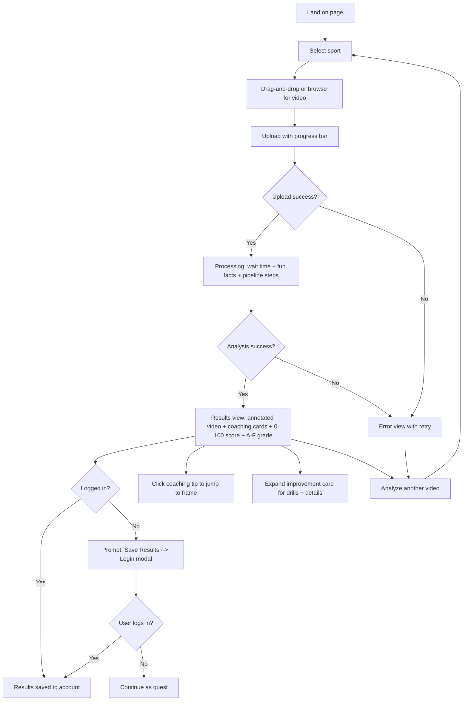
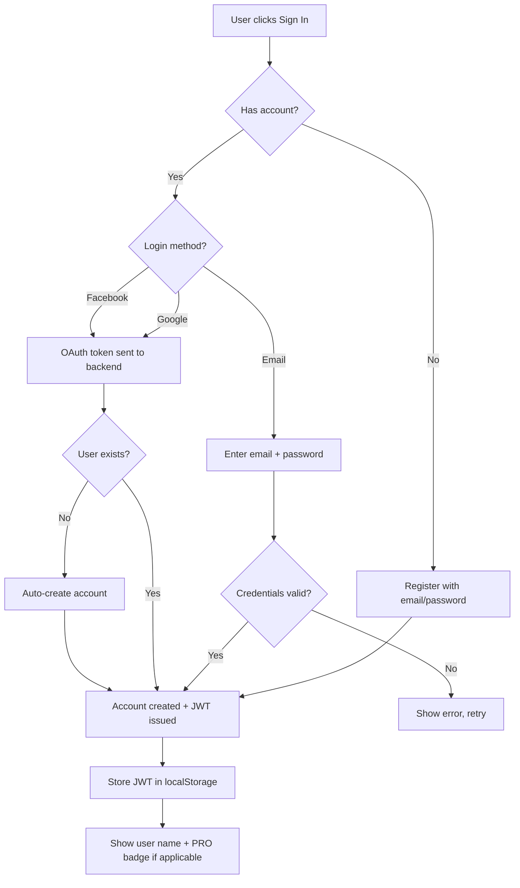
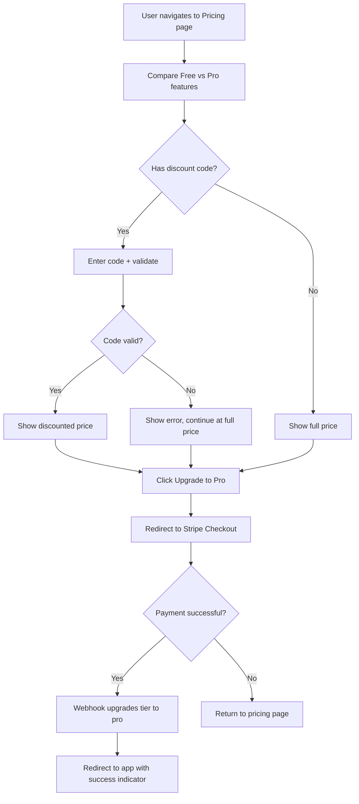
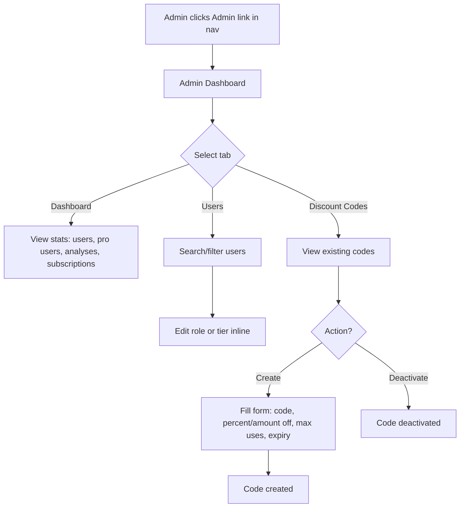
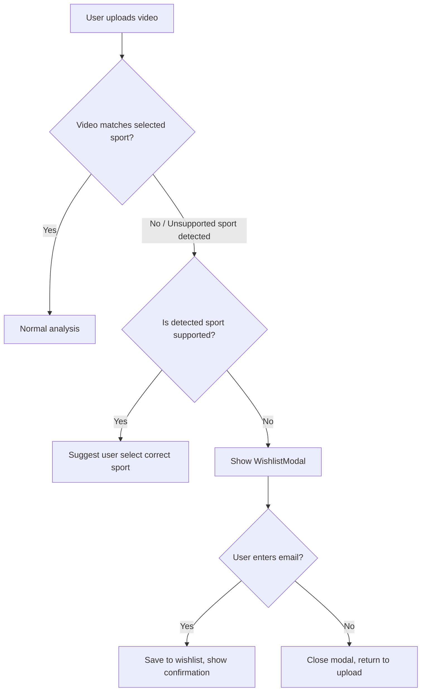
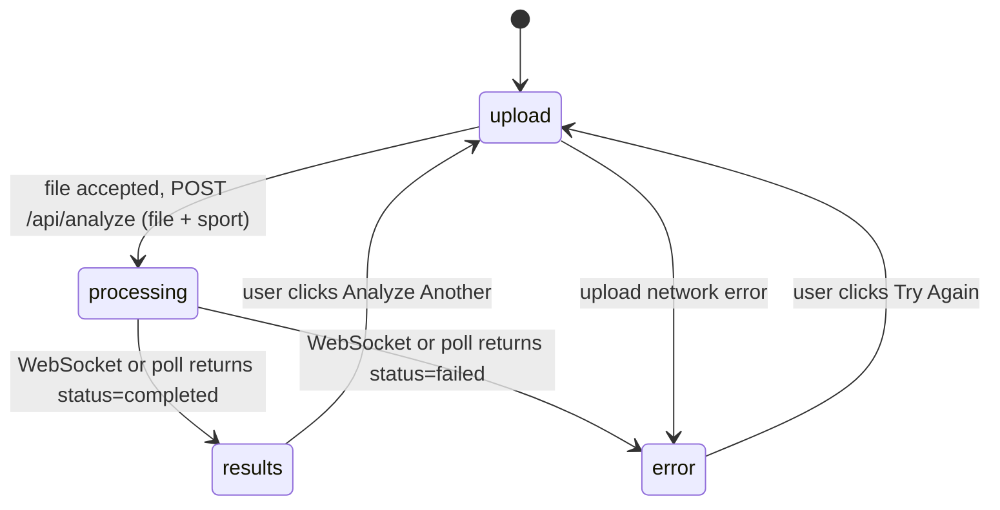
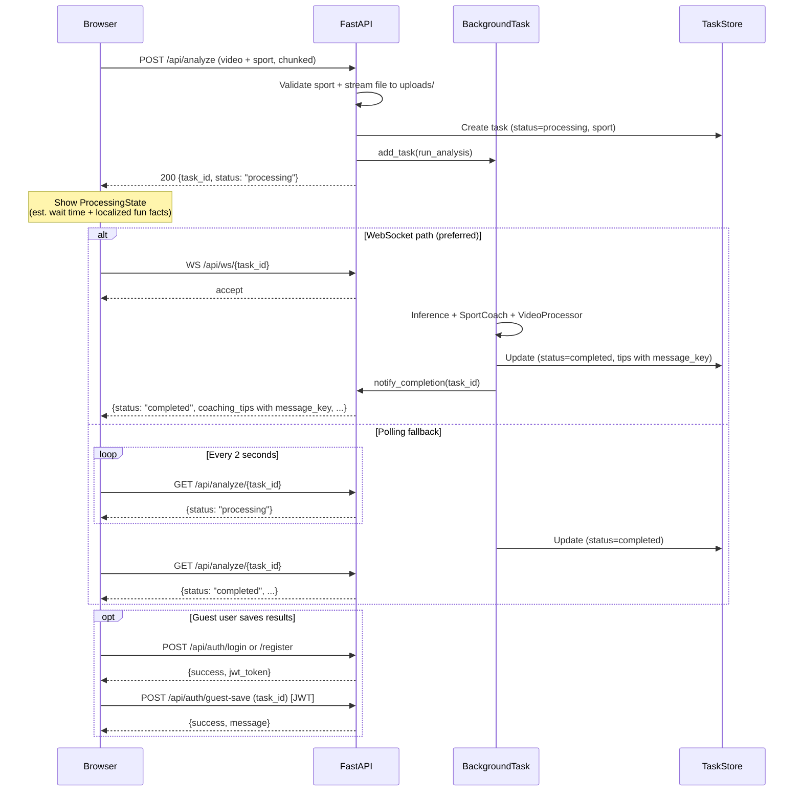

# Design Document

## 1. Product Vision

AI Sports Coach provides automated sports technique analysis through pose estimation and deterministic biomechanical rules. Users select a sport (snowboard, skiing, running, home_workout, yoga, or golf), upload a video, and the system extracts body keypoints frame-by-frame, then evaluates sport-specific biomechanical categories against sport-science thresholds.

The target audience is recreational athletes who want data-driven feedback on their form without hiring a coach. The platform supports:
- **Multi-sport selection** with 6 available sports and a wishlist system for future additions
- **10 languages** with automatic browser detection and manual switching
- **Tiered accounts** -- Free (1 saved video/sport) and Pro ($9.99/mo, 50 saved videos/sport)
- **Admin dashboard** for user management, analytics, and discount code generation
- **Mobile-responsive UI** with guest and authenticated modes
- **Async processing** with WebSocket push and automatic polling fallback
- **Overall 0-100 scoring with A-F grading** with difficulty-leveled drills (beginner/intermediate/advanced)

## 2. User Journeys

### 2.1 Core Analysis Flow



### 2.2 Registration and Login Flow



### 2.3 Pro Upgrade Flow



### 2.4 Admin Flow



### 2.5 Sport Mismatch Flow



## 3. Application State Machine



**State definitions:**

| State | Component | Description |
|-------|-----------|-------------|
| `upload` | `UploadZone` + `SportSelector` | Sport selection, drag-and-drop zone, file input, progress bar |
| `processing` | `ProcessingState` | Estimated wait time, progress bar, sport-specific fun facts, pipeline steps |
| `results` | `ResultsView` | Annotated video + coaching cards + 0-100 score + A-F grade + save prompt for guests |
| `error` | inline `<div>` | Error message with "Try Again" button |

**Global state (persists across FSM transitions):**

| State | Type | Description |
|-------|------|-------------|
| `user` | `User \| null` | Authenticated user info (null = guest) |
| `selectedSport` | `string` | Currently selected sport |
| `sports` | `SportInfo[]` | Available sports (fetched from API) |
| `page` | `string` | Current route: main, pricing, admin |
| `showLogin` | `boolean` | Login modal visibility |
| `showWishlist` | `boolean` | Wishlist modal visibility |

**Routing:**

| Route | Component | Access |
|-------|-----------|--------|
| Main | App (FSM) | All users |
| Pricing | `Pricing` (lazy) | All users |
| Admin | `Admin` (lazy) | Admin role only |

## 4. UI/UX Decisions

| Decision | Rationale |
|----------|-----------|
| **Multi-sport selector** | Emoji-labeled pill buttons above upload zone. Selected sport highlighted with cyan background. Makes sport selection intuitive and visual |
| **Dark-only theme** (`bg-slate-900`) | Maximizes contrast with video content; reduces glare when reviewing footage on mobile |
| **Mobile-first responsive** | All components use `sm:` breakpoints for larger screens |
| **Dynamic viewport height** (`100dvh`) | Avoids layout issues with mobile browser chrome (address bar) |
| **Touch optimization** | `touch-action: manipulation` on interactive elements |
| **Severity color coding** (emerald / amber / red) | Instant visual triage across all screen sizes |
| **Overall 0-100 score + A-F grade** | Numeric score with letter grade and color coding provides instant quality signal |
| **Difficulty-leveled drills** | Beginner/intermediate/advanced drills with duration make tips actionable |
| **2-column to 1-column layout** | `lg:grid-cols-2` on desktop, stacks on mobile |
| **Processing wait experience** | Estimated time (based on file size), progress bar, sport-specific fun facts every 6s from locale files |
| **Sport-specific emojis** | Different emoji for spinner, upload zone, and processing screen |
| **Guest + auth flow** | Full functionality without login. "Save Results" for guests opens modal |
| **Login/Register toggle** | Single modal handles both OAuth and email login/registration |
| **Language selector** | Flag + language name dropdown in nav bar, 10 languages |
| **PRO badge** | Cyan badge in nav bar for pro tier users |
| **Lazy-loaded pages** | Pricing and Admin pages are code-split to reduce initial bundle |
| **Wishlist for unsupported sports** | Modal with optional email signup, i18n translated |
| **Jump-to-frame** | `VideoPlayer.seekTo(seconds)` via `useImperativeHandle` |
| **Illustrated coaching diagrams** | Sport-specific SVG diagrams for each sport |
| **WebSocket-first monitoring** | Instant push with automatic 2-second polling fallback |
| **Framer Motion animations** | `AnimatePresence` for state transitions, staggered card entry |

## 5. API Design

### 5.1 Endpoints

| Method | Path | Description | Auth |
|--------|------|-------------|------|
| `POST` | `/api/analyze` | Upload video + sport (chunked, size enforced) | None |
| `GET` | `/api/analyze/{task_id}` | Get analysis status/results | None |
| `WS` | `/api/ws/{task_id}` | WebSocket push on completion | None |
| `GET` | `/api/sports/` | List available sports | None |
| `POST` | `/api/sports/wishlist` | Request notification for unsupported sport | None |
| `POST` | `/api/auth/register` | Register with email/password | None |
| `POST` | `/api/auth/login` | Authenticate via OAuth or email | None |
| `POST` | `/api/auth/guest-save` | Associate task with user account | JWT |
| `GET` | `/api/auth/me` | Get current user | Optional JWT |
| `POST` | `/api/payments/create-checkout` | Create Stripe checkout session | JWT |
| `GET` | `/api/payments/subscription` | Get subscription status | JWT |
| `POST` | `/api/payments/cancel` | Cancel subscription | JWT |
| `POST` | `/api/payments/validate-discount` | Validate discount code | None |
| `POST` | `/api/payments/webhook` | Stripe webhook handler | Stripe signature |
| `GET` | `/api/admin/stats` | Dashboard analytics | Admin |
| `GET` | `/api/admin/users` | List/search users | Admin |
| `PATCH` | `/api/admin/users/{id}/role` | Update user role | Admin |
| `PATCH` | `/api/admin/users/{id}/tier` | Update user tier | Admin |
| `POST` | `/api/admin/discount-codes` | Create discount code | Admin |
| `GET` | `/api/admin/discount-codes` | List discount codes | Admin |
| `DELETE` | `/api/admin/discount-codes/{id}` | Deactivate discount code | Admin |
| `GET` | `/api/videos/my-videos` | List saved videos | JWT |
| `POST` | `/api/videos/save` | Save analysis (quota enforced) | JWT |
| `DELETE` | `/api/videos/{id}` | Delete saved video | JWT |
| `GET` | `/api/health` | Health check | None |
| `GET` | `/results/{filename}` | Static file (Cache-Control: immutable) | None |

### 5.2 Request/Response Schemas

**`UploadResponse`**
```json
{
  "task_id": "uuid-string",
  "status": "processing"
}
```

**`AnalysisResult`** (returned by GET `/api/analyze/{task_id}`)
```json
{
  "task_id": "uuid-string",
  "status": "processing | completed | failed",
  "sport": "snowboard",
  "coaching_tips": ["CoachingTipSchema"],
  "video_url": "/results/{task_id}_annotated.mp4 | null",
  "keypoints_summary": "KeypointsSummary | null",
  "coaching_summary": "CoachingSummary | null",
  "video_fps": 30.0,
  "error": "string | null",
  "sport_mismatch": {
    "selected_sport": "snowboard",
    "detected_environment": "unrecognized",
    "suggested_sport": "skiing",
    "message": "This video doesn't look like..."
  }
}
```

The `sport_mismatch` field is `null` when the video matches the selected sport. When populated, it contains the selected sport, the detected environment label, an optional suggested sport, and a human-readable message.

**`CoachingTipSchema`**
```json
{
  "category": "Knee Flexion | Shoulder Alignment | Stance Width | ...",
  "body_part": "front_knee | back_knee | shoulders | feet | ...",
  "angle_value": 167.3,
  "threshold": 160.0,
  "message": "Your front knee is getting straight at 167 degrees...",
  "message_key": "coaching.kneeFlexion.warning",
  "message_params": {"leg": "front", "angle": 167},
  "severity": "ok | warning | critical",
  "frame_range": [6, 18],
  "confidence": "high | low"
}
```

**`CoachingSummary`**
```json
{
  "overall_assessment": "Several issues need attention...",
  "overall_assessment_key": "coaching.summary.needsAttention",
  "overall_score": 82,
  "overall_grade": "B",
  "category_breakdowns": [
    {
      "category": "Knee Flexion",
      "count": 3,
      "avg_angle_value": 165.2,
      "worst_severity": "critical"
    }
  ],
  "top_tips": ["CoachingTipSchema"]
}
```

**`RegisterRequest`**
```json
{
  "email": "user@example.com",
  "password": "SecurePass123",
  "display_name": "Jane Doe"
}
```

**`RegisterResponse`**
```json
{
  "success": true,
  "user_id": "uuid",
  "display_name": "Jane Doe",
  "email": "user@example.com",
  "jwt_token": "jwt-string",
  "tier": "free"
}
```

**`LoginRequest`**
```json
{
  "provider": "google | facebook | email",
  "token": "oauth-token-or-password",
  "email": "user@example.com"
}
```

**`LoginResponse`**
```json
{
  "success": true,
  "user_id": "uuid",
  "display_name": "Jane Doe",
  "email": "jane@example.com",
  "jwt_token": "jwt-string",
  "tier": "free | pro",
  "message": "Logged in via google"
}
```

**`UserProfile`** (returned by GET `/api/auth/me`)
```json
{
  "authenticated": true,
  "user_id": "uuid",
  "display_name": "Jane Doe",
  "email": "jane@example.com",
  "role": "user | admin | support | tester",
  "tier": "free | pro"
}
```

**`SavedVideoResponse`**
```json
{
  "id": "uuid",
  "task_id": "uuid",
  "sport": "snowboard",
  "filename": "my_run.mp4",
  "created_at": "2026-03-11T10:00:00Z"
}
```

### 5.3 Async Processing Pattern



## 6. Coaching Logic Design

### 6.1 Keypoint Model (Snowboard)

The snowboard sport uses a custom-trained ResNet-50 model that predicts 10 keypoints per frame:

```
        (0) head
        /        \
  (1) nose_     (2) tail_
  shoulder      shoulder
        \       /
      (3) center_hips
        /           \
  (4) front_    (5) back_
  knee              knee
    |                 |
  (6) front_    (7) back_
  ankle             ankle
    |                 |
  (8) board_    (9) board_
  nose              tail
```

Skiing uses a 14-keypoint model with left/right shoulders, knees, ankles, ski tips, ski tails, and pole tips. Other sports use MediaPipe or sport-specific keypoint definitions configured via their `SportDefinition`. Each `SportDefinition` declares its own `keypoints` list, `skeleton` connections, and optional `model_filename` for custom models.

### 6.2 Sport-Specific Analysis Categories

Each sport defines its own biomechanical analysis categories via the `SportDefinition.coaching_categories` field and corresponding `SportCoach` implementation:

| Sport | Categories | Notes |
|-------|-----------|-------|
| Snowboard | Knee Flexion, Shoulder Alignment, Stance Width | Custom ResNet-50 keypoint model |
| Skiing | Knee Angle, Hip Alignment, Ski Parallelism, Pole Position | Custom ResNet-50 keypoint model (14 keypoints) |
| Running | Forward Lean, Arm Swing, Cadence, Foot Strike | MediaPipe-based |
| Home Workout | Squat Form, Push-up Form, Plank Form | MediaPipe-based |
| Yoga | Spine Alignment, Balance, Joint Angles, Symmetry | MediaPipe-based |
| Golf | Spine Angle, Arm Extension, Hip Rotation, Head Stability | MediaPipe-based |

Snowboard biomechanical thresholds (other sports define their own in their respective coach modules):

| Check | Measurement | OK | Warning | Critical |
|-------|-------------|-----|---------|----------|
| Knee flexion (front) | Hip-knee-ankle angle | 90-140 deg | > 160 deg | > 170 deg |
| Knee flexion (back) | Hip-knee-ankle angle | 90-140 deg | > 160 deg | > 170 deg |
| Shoulder-board alignment | Shoulder-to-board angle | 0-10 deg | > 15 deg | > 30 deg |
| Stance width | Ankle distance / board length | > 20% | < 20% | -- |

### 6.3 i18n Integration

All coaching tips include machine-readable translation keys alongside human-readable English messages:

```python
CoachingTip(
    message="Your front knee is getting straight at 167 deg...",
    message_key="coaching.kneeFlexion.warning",
    message_params={"leg": "front", "angle": 167},
)
```

The frontend renders localized text via:
```tsx
t(tip.message_key, tip.message_params)  // Uses react-i18next
```

Summary assessments also include keys:
- `coaching.summary.excellent` -- no issues detected
- `coaching.summary.solid` -- A or B grade
- `coaching.summary.decent` -- C grade
- `coaching.summary.needsAttention` -- D, E, or F grade

### 6.4 Frame Merging Strategy

Raw tips are generated per-frame. Consecutive tips with the **same category + body_part + severity** and a frame gap of **5 or fewer** are merged into a single tip with a widened frame range.

### 6.5 Coaching Summary Generation

1. **Group** all tips by category
2. **Build category breakdowns**: count, average angle value, worst severity
3. **Select top 5 tips**: sorted by severity descending, then by frame span descending
4. **Compute numeric score** via `_compute_numeric_score()` (see section 6.6)
5. **Map score to grade** via grade ranges (see section 6.6)
6. **Narrative assessment** with i18n key (based on grade):
   - Grade A or B: "Solid technique overall, with a few areas to refine" (`coaching.summary.solid`)
   - Grade C: "Decent form with some areas that need work" (`coaching.summary.decent`)
   - Grade D, E, or F: "Several issues need attention" (`coaching.summary.needsAttention`)
   - No tips at all: "Excellent technique! No issues detected" (`coaching.summary.excellent`)

### 6.6 Overall Score (0-100 Numeric Score + A-F Grading)

The **backend** computes the overall numeric score in `_compute_numeric_score()` located in `app/services/coach_logic/base.py`. The score is returned as part of `CoachingSummary` along with the letter grade.

**Scoring algorithm:**

The score starts at 100 and subtracts penalties per category:

1. **Frame coverage**: For each category, compute the fraction of total frames affected by tips in that category.
2. **Overshoot**: For each tip, compute how far the measured value exceeds the threshold, normalized by the threshold. Average across all tips in the category.
3. **Severity multiplier**: 0.6 for warning-only categories, 1.2 for categories containing at least one critical tip.
4. **Category weight**: Each category has a configurable weight (e.g., Knee Flexion = 1.2, Shoulder Alignment = 1.0, Stance Width = 0.8). Unknown categories default to 1.0.
5. **Confidence-based score weight**: Each tip has a `score_weight` (0.0-1.0) based on keypoint confidence. Body-based tips use 1.0 (full penalty); equipment-based tips (ski parallelism, pole position, shoulder-board alignment, stance width) use 0.3-0.4 (reduced penalty) because equipment keypoints have higher prediction error. The average `score_weight` across tips in a category is applied as a multiplier on the penalty.
6. **Penalty formula**: `max_penalty_per_category * coverage * severity_mult * (1.0 + avg_overshoot) * weight * avg_score_weight`, capped at `max_penalty_per_category * weight * avg_score_weight`.
7. **max_penalty_per_category**: 35 points.
8. **Final score**: `max(0, min(100, round(100 - sum_of_penalties)))`.

**Grade ranges:**

| Grade | Score Range | Color |
|-------|------------|-------|
| A | 90-100 | Emerald |
| B | 80-89 | Green |
| C | 65-79 | Yellow |
| D | 50-64 | Orange |
| E | 35-49 | Red-Orange |
| F | 0-34 | Red |

### 6.7 Drill System

Each coaching category includes difficulty-leveled drills:

```typescript
interface DrillInfo {
  name: string;           // "Wall Squats"
  description: string;    // "Stand with back against wall..."
  duration: string;       // "3 sets of 15"
  difficulty: "beginner" | "intermediate" | "advanced";
}
```

Drills are sport-specific -- snowboard drills reference edges and turns, running drills reference cadence and footstrike patterns, yoga drills reference poses and stretches, etc.

## 7. Tier System

### 7.1 Feature Comparison

| Feature | Free | Pro ($9.99/mo) |
|---------|------|----------------|
| Video analysis | Unlimited | Unlimited |
| Saved videos per sport | 1 | 50 |
| Coaching tips + 0-100 score + A-F grade | Full | Full |
| Drills (all difficulties) | Full | Full |
| 10 languages | Full | Full |
| Priority support | No | Yes |
| Progress tracking | No | Yes |

### 7.2 Quota Enforcement

- Checked at save time via `check_video_quota(user, sport, db)`
- Counts `AnalysisRecord` rows for user + sport
- Configurable via `free_tier_videos_per_sport` and `pro_tier_videos_per_sport` settings
- Returns HTTP 403 with "quota exceeded" message when limit reached

### 7.3 Payment Flow

1. User clicks "Upgrade to Pro" on Pricing page
2. Optional discount code validation via `POST /api/payments/validate-discount`
3. `POST /api/payments/create-checkout` creates a Stripe Checkout Session
4. User redirected to Stripe's hosted checkout page
5. On success, Stripe sends `checkout.session.completed` webhook
6. Backend creates `Subscription` record and upgrades user tier to `pro`
7. User redirected back to app with `?upgraded=true` query param

### 7.4 Discount Codes

| Field | Type | Description |
|-------|------|-------------|
| `code` | string | Unique code (e.g., "LAUNCH20") |
| `percent_off` | int | Percentage discount (0-100) |
| `amount_off` | decimal | Fixed amount off |
| `max_uses` | int | Maximum redemptions (0 = unlimited) |
| `times_used` | int | Current redemption count |
| `valid_until` | datetime | Expiry date (null = no expiry) |
| `is_active` | bool | Can be deactivated by admin |

## 8. Role-Based Access Control

### 8.1 Roles

| Role | Permissions |
|------|-------------|
| `user` | Analyze videos, save results, manage own account, subscribe |
| `tester` | Same as user + access to test features |
| `support` | Same as user + view other users' data |
| `admin` | Full access: user management, discount codes, analytics, role/tier editing |

### 8.2 Enforcement

- Route-level via `Depends(require_role("admin"))` FastAPI dependency
- Frontend hides admin link for non-admin users
- JWT payload includes `role` claim for client-side checks

## 9. Internationalization Strategy

### 9.1 Supported Languages

| Language | Code | Region |
|----------|------|--------|
| English | `en` | Default |
| French | `fr` | France |
| Spanish | `es` | Spain/LatAm |
| Italian | `it` | Italy |
| Japanese | `ja` | Japan |
| German | `de` | Germany |
| Austrian German | `de-AT` | Austria (colloquial phrasing, "Schifahren" instead of "Skifahren") |
| Russian | `ru` | Russia |
| Hindi | `hi` | India |
| Czech | `cs` | Czech Republic |

### 9.2 Architecture

- **Frontend i18n**: `react-i18next` with `i18next-http-backend` (lazy-loads `/locales/{lng}/{ns}.json`)
- **Backend i18n**: coaching tips include `message_key` + `message_params`; frontend renders localized text
- **Browser detection**: `i18next-browser-languagedetector` auto-selects language on first visit
- **Manual switching**: `LanguageSelector` component in nav bar
- **Two namespaces**: `common` (UI strings) and `coaching` (tips, guidance, sport facts)
- **Interpolation**: all variable values (angles, counts, sport names) passed as params, not embedded in translations

### 9.3 Translation File Structure

```
public/locales/{lng}/
├── common.json     # ~160 lines: app, upload, processing, results, improve,
│                   #   severity, login, wishlist, pricing, admin, sports, errors, nav
└── coaching.json   # ~80 lines: tip messages, guidance sections, sport facts
```

## 10. Configuration

All settings managed via `pydantic-settings` with `.env` file support:

| Category | Fields |
|----------|--------|
| Server | `backend_host`, `backend_port`, `allowed_origins`, `environment` |
| Storage | `upload_dir`, `results_dir`, `task_store_dir`, `wishlist_dir`, `models_dir`, `model_path` |
| Limits | `max_upload_size_mb`, `free_tier_videos_per_sport`, `pro_tier_videos_per_sport` |
| Auth | `jwt_secret`, `google_client_id`, `google_client_secret`, `facebook_app_id`, `facebook_app_secret` |
| Database | `database_url` |
| Payments | `stripe_secret_key`, `stripe_webhook_secret`, `stripe_price_id_pro` |
| Performance | `inference_batch_size`, `inference_sample_rate`, `max_analysis_workers`, `cleanup_max_age_hours` |

## 11. Sport Support Strategy

### 11.1 SportRegistry Architecture

Sports are managed via the `SportRegistry` pattern in `app/sports/`. Each sport is defined by two components:

1. **`SportDefinition`** (in `app/sports/base.py`): Declares the sport's keypoints, skeleton connections, coaching categories, model configuration, and region colors.
2. **`SportCoach`** (protocol in `app/sports/base.py`): Implements `analyze_frame()`, `analyze_sequence()`, `compute_keypoints_summary()`, and `generate_coaching_summary()`.

Each sport module in `app/sports/` (e.g., `snowboard.py`, `skiing.py`) creates a `SportDefinition` instance and calls `SportRegistry.register()` to make it available. The `SportRegistry` class (in `app/sports/registry.py`) provides `get_definition()`, `get_coach()`, `list_sports()`, and `has_sport()` methods.

Per-sport coaching logic lives in `app/services/coach_logic/` as a package with:
- `base.py` -- shared utilities (`CoachingTip`, `merge_consecutive_tips`, `_compute_numeric_score`, `generate_coaching_summary`)
- `snowboard.py` -- snowboard-specific biomechanical checks
- `skiing.py` -- skiing-specific biomechanical checks
- `running.py` -- running-specific biomechanical checks
- `home_workout.py` -- home workout form checks
- `yoga.py` -- yoga pose analysis
- `golf.py` -- golf swing analysis

### 11.2 Currently Available Sports

| Sport ID | Display Name | Categories |
|----------|-------------|------------|
| `snowboard` | Snowboarding | Knee Flexion, Shoulder Alignment, Stance Width |
| `skiing` | Skiing | Knee Angle, Hip Alignment, Ski Parallelism, Pole Position |
| `running` | Running | Forward Lean, Arm Swing, Cadence, Foot Strike |
| `home_workout` | Home Workout | Squat Form, Push-up Form, Plank Form |
| `yoga` | Yoga | Spine Alignment, Balance, Joint Angles, Symmetry |
| `golf` | Golf | Spine Angle, Arm Extension, Hip Rotation, Head Stability |

### 11.3 Adding a New Sport

1. Create `app/sports/{sport}.py` with a `SportDefinition` and call `SportRegistry.register()`
2. Create `app/services/coach_logic/{sport}.py` with a `SportCoach` implementation
3. Add CLIP labels to `scene_detection.py` for sport/environment detection
4. Add coaching guidance + drills to `frontend/src/data/coachingGuidance.ts`
5. Add fun facts to `frontend/src/data/sportFacts.ts`
6. Add SVG illustrations to `frontend/src/components/illustrations/`
7. Add translation keys to all 10 locale files (`common.json` and `coaching.json`)

### 11.4 Unregistered Sports

Skateboarding and surfing exist as CLIP labels in `scene_detection.py` for environment detection purposes but are not registered as full sports in `SportRegistry`. Videos detected as skateboarding or surfing will trigger the sport mismatch flow and wishlist modal.

## 12. Future Directions

- **Desktop application** -- Tauri v2 + PyInstaller sidecar for native macOS/Windows/Linux app with local video analysis
- **More training data** -- expand beyond 1100/600 frames to improve model accuracy (currently blocked by YouTube auth)
- **Sport-specific models for remaining sports** -- train dedicated keypoint models for running, yoga, golf, home workout
- **Higher input resolution** -- 384x384 showed promise with more data, revisit when dataset is larger
- **Test-time augmentation** -- average predictions across flipped/rotated inputs for better accuracy
- **Comparison mode** -- upload two videos side-by-side to track improvement
- **Streaming partial results** -- push tips over WebSocket as frames are processed
- **Additional biomechanical checks** -- hip counter-rotation, arm position, weight distribution
- **Multi-rider support** -- detect and analyze multiple athletes
- **Stance detection** -- automatically determine regular vs. goofy
- **Progress tracking** -- historical comparison across sessions for Pro users
- **Team features** -- coaches can manage multiple athletes
- **Video trimming** -- select specific segment before analysis
